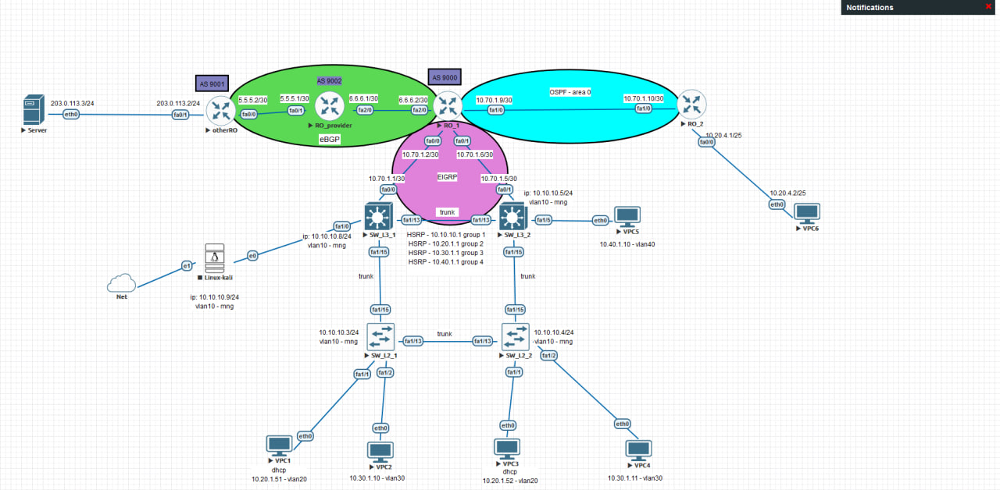

# Ansible Cisco Configuration Project

Этот проект предназначен для автоматизации настройки устройств Cisco с использованием Ansible. 
Он включает в себя роли и playbooks для выполнения различных конфигураций на устройствах Cisco.



## Конфигурация

Конфигурация выполняется для следующих устройств:

- SW_L3_1, 
- SW_L3_2, 
- SW_L2_1, 
- SW_L2_2,
- RO_1, 
- RO_2

В рамках проекта произведена настройка следующих функций:

- VLAN
- STP
- HSRP
- DHCP
- EIGRP
- OSPF (с использованием шаблонов Jinja2)
- EtherChannel между SW_L3_1 и SW_L3_2 
- BGP между автономными системами (9000, 9001, 9002)

> Настройка EtherChannel и BGP выполнялась вручную!

## Структура репозитория

- `ansible.cfg`: Конфигурация Ansible для проекта.
- `inventory/hosts.yml`: Инвентарь с информацией о Cisco устройствах, на которых будет выполнена конфигурация.
- `playbooks/`: Папка с Ansible playbooks для настройки устройств.
  - `ospf_setup.yml`: Пример playbook для настройки OSPF и других параметров на Cisco устройствах.
- `roles/ospf_setup/`: Роль для настройки OSPF.
  - `tasks/`: Задачи для конфигурации устройств.
    - `main.yml`: Основной файл с задачами.
  - `vars/`: Переменные, используемые в роли.
    - `main.yml`: Переменные для настройки OSPF.
  - `templates/`: Шаблоны Jinja2 для генерации конфигураций.
    - `main.yml`: Шаблон для настройки OSPF.

## Установка и настройка

1. Установка необходимых зависимостей из requirements.txt:
   ```bash
   pip install -r requirements.txt


2. **Клонируйте репозиторий:**
   ```bash
   git clone https://github.com/eva_95/ansible_cicso_config_proj_01.git
   cd ansible_cicso_config_proj_01

3. Запуск плейбука 
   ```bash
   ansible-playbook -i inventory/hosts.yml playbooks/ospf_setup.yml

***Перед запуском плейбука должно быть установленно соединение с каждым устройством по ssh, 
а так же настроен vlan-управления!
